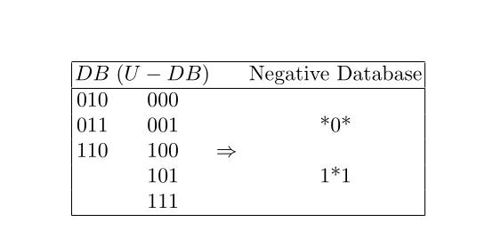
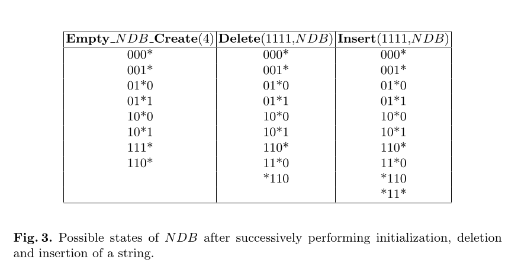

# online-negative-database
## this is an implementation for negative database that uses negative representation instead of the positive (actual) data for security reasons.
Negative representations of data can
provide an extra level of protection for systems in which acquiring the detector
set (the set of strings that detect anomalies) might produce a security breach.
We described an algorithm for generating negative databases on-line.
### refrence : On-line Negative Databases
Fernando Esponda, Elena S. Ackley, Stephanie Forrest, and Paul Helman
Department of Computer Science
University of New Mexico 

### made under advisor: PHD. Mohamed Hassan Ibrahim 
### Department of computer science
### University of Fayoum

